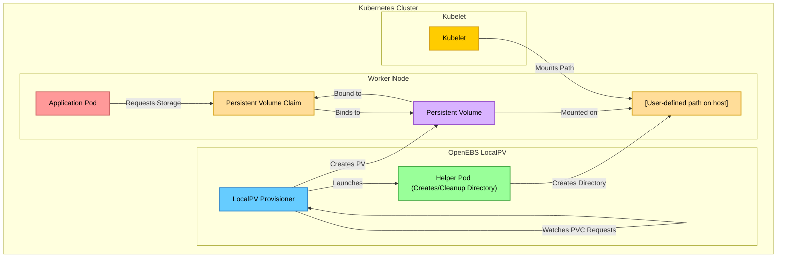

# OpenEBS Dynamic LocalPV Provisioner

## Overview

OpenEBS Dynamic LocalPV Provisioner is an open‐source Kubernetes component that automates the dynamic provisioning of local persistent volumes. It converts local storage available on Kubernetes nodes, such as hostPath directories into persistent volumes accessible via PVCs. The provisioner automatically assigns node affinity metadata, ensuring that pods run on the node hosting the storage. The tool simplifies local storage management by automating volume creation, binding, and cleanup processes for hostpaths. It overcomes challenges of static provisioning by dynamically allocating storage on demand. Overall, the provisioner offers a robust, scalable solution for managing local persistent hostpath volumes in Kubernetes.

## Why OpenEBS Dynamic LocalPV Provisioner?

- <b>Dynamic Provisioning</b>: Automatically creates persistent hostpath volumes on demand from local node storage, reducing manual configuration. 
- <b>Seamless Kubernetes Integration</b>: Uses node affinity to ensure pods are scheduled on the node where the volume is located, maintaining data consistency.  
- <b>Customizable Storage Behavior</b>: Offers flexible configuration through StorageClasses, supporting hostpath features like quota enforcement etc.
- <b>Optimized for High Performance</b>: Ideal for high-performance, low-latency, stateful applications like replicated databases which need local storage. 

## Architecture

Please check [here](./design/hostpath_localpv_provisioner.md) for complete design and architecture.

## Kubernetes Compatibility Matrix

|          | Kubernetes <= 1.18 | Kubernetes >=1.19 |
|----------|--------------------|-------------------|
| `v4.0.x` | ✕                  | ✓                 | 
| `v4.1.x` | ✕                  | ✓                 |
| `v4.2.x` | ✕                  | ✓                 |
| `HEAD`   | ✕                  | ✓                 |

## Documents

- [Prerequisites](./docs/quickstart.md#prerequisites)
- [Quickstart](./docs/quickstart.md#quickstart)
- [Developer Setup](./docs/developer.md)
- [Testing](./docs/developer-setup.md#testing)
- [Contibuting Guidelines](./CONTRIBUTING.md)
- [Governance](./GOVERNANCE.md)
- [Changelog](./CHANGELOG.md)
- [Release Process](./RELEASE.md)

## Features

- [x] Access Modes
    - [x] ReadWriteOnce
    - ~~ReadOnlyMany~~
    - ~~ReadWriteMany~~
- [x] Volume modes
    - [x] `Filesystem` mode
    - [ ] `Block` mode
- [x] [Volume Resize(Via Quotas)](./docs/tutorials/hostpath/xfs_quota/)

## Inspiration/Credit

OpenEBS Local PV has been inspired by the prior work done by the following the Kubernetes projects:

- <https://github.com/kubernetes-sigs/sig-storage-lib-external-provisioner/tree/HEAD/examples/hostpath-provisioner>
- <https://github.com/kubernetes-sigs/sig-storage-local-static-provisioner>
- <https://github.com/rancher/local-path-provisioner>

## Dev Activity dashboard

## License Compliance

## OpenEBS is a [CNCF Sandbox Project](https://www.cncf.io/projects/openebs)

