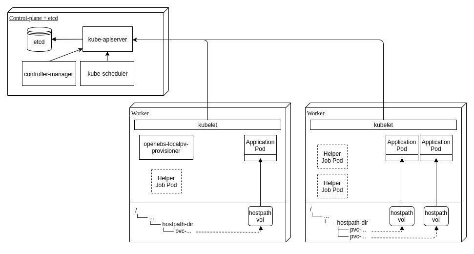

# Hostpath LocalPV Provisioner

## Table of Contents

* [Table of Contents](#table-of-contents)
* [Summary](#summary)
* [Problem](#problem)
* [Current Solution](#current-solution)
* [Proposal](#proposal)
    * [Hostpath LocalPV StorageClass](#hostpath-localpv-storageclass)
    * [Hostpath LocalPV Provisioner Controller](#hostpath-localpv-provisioner-controller)
    * [Workflow](#workflow)
* [Test Plan](#test-plan)
* [GA Criteria](#ga-criteria)

## Summary

This is a design proposal to implement a dynamic local hostpath volume provisioner for Kubernetes. This doc describes how the provisioner can help you create (provision) and delete (deprovision) Kubernetes PersistentVolumes for Kubernetes Pods using the storage capacity available to the Kubernetes Pod's host node's local filesystem. This storage unit should then be made available via a path embedded into a Kubernetes PersistentVolume. This design document requires you to define the storage configuration in Kubernetes StorageClass objects with its `spec.provisioner` set to 'openebs.io/local'. This dynamic provisioner's provisioning and deprovisioning functionality should be made available when a Kubernetes PersistentVolumeClaim object, with `spec.storageClassName` set to any such StorageClass's Name, is created and deleted respectively.

## Problem

Containerized stateful applications require persistent storage. To meet this requirement, Kubernetes Pods running stateful applications require Kubernetes PersistentVolume objects. But, PersistentVolume Kubernetes REST API objects aren't readily made available even though the infrastructure (local hostpath directory) is available. This presents itself as a problem when a stateful application pod requires a PersistentVolume.

## Current Solution

Presently, to create a Kubernetes PersistentVolume using the path to a local directory, the administration has to perform the following operations:
- Log in to the host node
- Create the directory whose path will be used in the PersistentVolume
- Log out of the host node, and back into the cluster-administration interface
- Create a Kubernetes PersistentVolume using the directory path in a YAML
- Create a PersistentVolumeClaim using the above PersistentVolume's Name in a YAML

If you follow the above approach, you will require the administrator to manually create the PersistentVolume for each of you stateful application Pods. Manually creating the PersistentVolumes is not a scalable solution, and it also requires the administrator to be available to perform these operations.

## Proposal

### Hostpath LocalPV StorageClass

This component will be a Kubernetes StorageClass object (storage.k8s.io/v1) which has its `spec.provisioner` set to 'openebs.io/local'. This provisioner name must be unique, so that the correct storage plugin may process the provisioning request.

The above StorageClass will also allow for storage configuration via the unique `metadata.annotations` key 'cas.openebs.io/config'. The following configuration options will be available:
- BasePath -- You may use this to set the directory path for the hostpath directory.
- NodeAffinityLabel -- You may use this to identify Kubernetes Nodes based on differences in the label value of the key specified in this parameter.

A sample StorageClass instance YAML spec will look like this:

```yaml
apiVersion: storage.k8s.io/v1
kind: StorageClass
metadata:
  name: openebs-hostpath
  annotations:
    openebs.io/cas-type: local
    cas.openebs.io/config: |
      - name: StorageType
        value: "hostpath"
      - name: BasePath
        value: "/var/openebs/local/"
provisioner: openebs.io/local
volumeBindingMode: WaitForFirstConsumer
reclaimPolicy: Delete
```

### Hostpath LocalPV Provisioner Controller



The 'controller' package from the [github.com/kubernetes-sigs/sig-storage-lib-external-provisioner](https://github.com/kubernetes-sigs/sig-storage-lib-external-provisioner) will be run as a listwatching controller. The controller will deploy SharedInformers for the v1 and storage.k8s.io/v1 API objects. It will sync workqueues for PersistentVolumeClaim and PersistentVolume jobs.

PersistentVolumeClaims created with the provisioner name set to 'openebs.io/local' will be picked up for provisioning. The provisioner will require delayed binding (volumeBindingMode: WaitForFirstConsumer) to provision the local hostpath volume on the Kubernetes Node where the Pod has been scheduled to run. The provisioner will perform the following operations while provisioning a hostpath volume:
- Receive provisioning job for PersistentVolumeClaim
- Validate configuration options set on StorageClass and PersistentVolumeClaim
- Merge configuration options from StorageClass and PersistentVolumeClaim
- Generate PersistentVolume name
- Create an 'init' Pod
	- Create directory at specified/default hostpath directory using PersistentVolume name
- Exit 'init' Pod
- Create PersistentVolume object
	- Set name as generated above
	- Set directory path
	- Set node selector label key (optional)
The provisioned volume may be consumed as a mountpoint from inside the application Pod.

PersistentVolumes with the label `pv.kubernetes.io/provisioned-by: openebs.io/local` set, when deleted, will trigger the deprovisioning process. The operations involved will be as follows:
- Receive deletion job for PersistentVolume
- Create a 'cleanup' Pod
	- Remove the hostpath directory and its contents
- Exit 'cleanup' Pod
- Delete PersistentVolume object

The Hostpath provisioner Deployment, RBAC components and the default StorageClass YAMLs may be made available via GitHub Pages or similar hosting methods.

### Workflow

You should be able to follow the steps below to provision a local hostpath volume dynamically:
- Deploy Hostpath LocalPV Provisioner
```bash
kubectl apply -f https://openebs.github.io/charts/hostpath-operator.yaml
```
- Create StorageClass
```bash
kubectl create -f <sc-yaml-file>
```
- Create PersistentVolumeClaim
```bash
kubectl create -f <pvc-yaml-file>
```
- Create application Pod which consumes above PersistentVolumeClaim
```bash
kubectl create -f <pod-yaml-file>
```

You should be able to follow the steps below to delete a local hostpath volume:
- Delete application Pod
```bash
kubectl delete <pod-name> -n <namespace>
```
- Delete PersistentVolumeClaim
```bash
kubectl delete pvc <pvc-name> -n <namespace>
```

## Test Plan

- Create a hostpath volume
- Create a BusyBox Pod and mount the volume to it.
- Verify if the provisioning and the mount succeeds.
- Delete the BusyBox Pod
- Delete the PersistentVolumeClaim.
- Verify if the Persistent Volume is Deleted.

## GA Criteria

Once all of the test cases are part of e2e pipeline and running without any failure, this can be released as GA.

